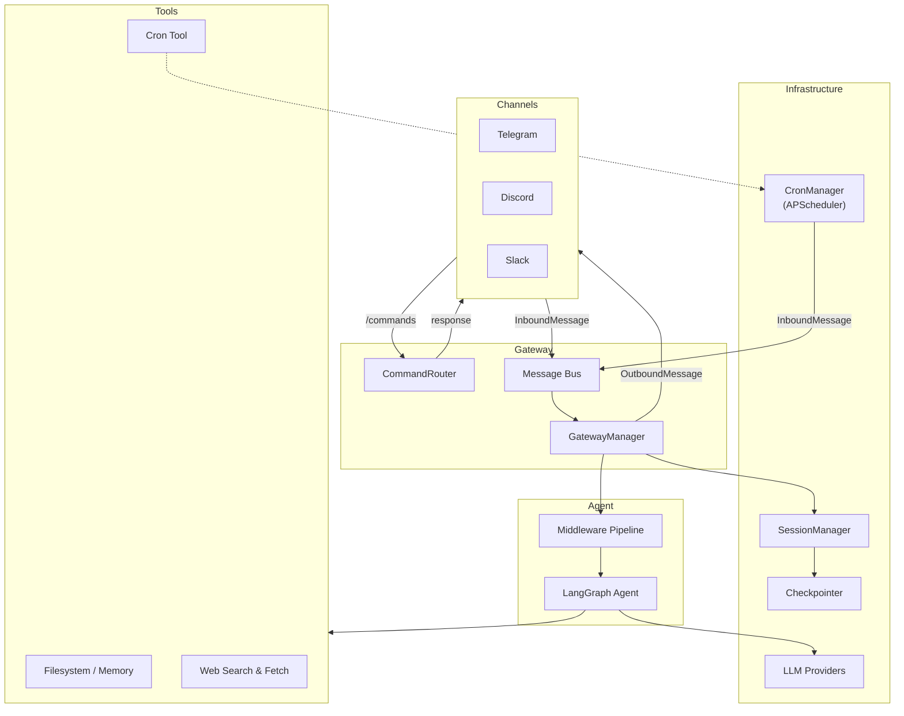

# langclaw

A multi-channel AI assistant framework with scheduled tasks, persistent memory, and a pluggable tool ecosystem.

## Architecture

### Data flow

1. **User sends a message** on any channel (Telegram, Discord, Slack).
2. **Commands** (`/start`, `/reset`, `/help`, `/cron`) are handled instantly by the `CommandRouter` — they bypass the bus and never reach the LLM.
3. **Regular messages** are published as `InboundMessage` to the message bus.
4. **GatewayManager** consumes from the bus, resolves (or creates) a LangGraph thread via `SessionManager`, and streams the message through the agent.
5. **Middleware** runs before the LLM: channel context injection, rate limiting, content filtering, PII redaction.
6. **The agent** (LangGraph) processes the message with access to tools — filesystem/memory, web search, web fetch, and cron scheduling.
7. **Streaming chunks** (tool calls, tool results, AI text) are converted to `OutboundMessage` and forwarded back to the originating channel.
8. **Cron jobs** fire on schedule and publish `InboundMessage` to the same bus, flowing through the same agent pipeline as user messages.

### Packages

| Package | Purpose |
|---|---|
| `cli/` | CLI entry points (`langclaw gateway`, `langclaw cron list`, etc.) |
| `gateway/` | Channel orchestration, command routing, message dispatch |
| `bus/` | Message bus abstraction (asyncio, RabbitMQ, Kafka) |
| `agents/` | LangGraph agent construction and tool wiring |
| `middleware/` | Request pipeline (rate limit, content filter, PII) |
| `providers/` | LLM provider registry (OpenAI, Anthropic, Google, Azure) |
| `cron/` | Scheduled jobs via APScheduler v4 (SQLite/Postgres persistence) |
| `session/` | Maps (channel, user, context) to LangGraph thread IDs |
| `checkpointer/` | Conversation state persistence (SQLite/Postgres) |
| `config/` | Pydantic-settings configuration with env var support |
